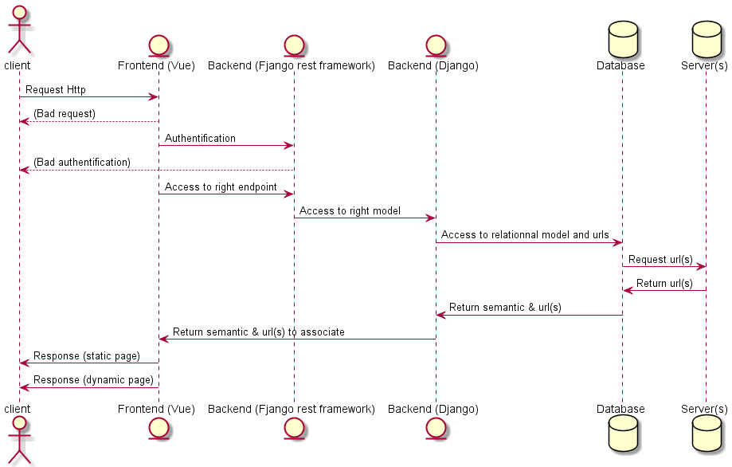
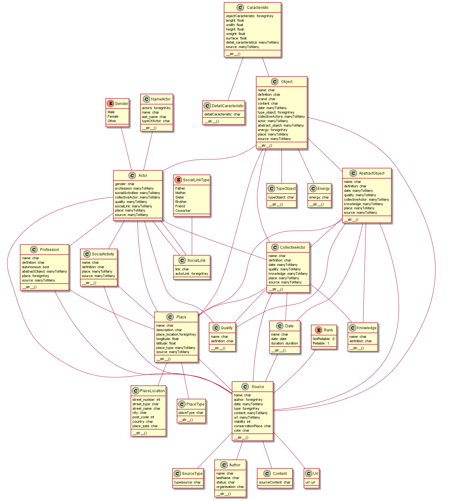

# API of the Techn’hom Time Machine

A historical and patrimony dababase used for Belfort's campus.
It is used for historical research  

## Requirement
*Git CLI
*UNIX Terminal
*Python 3.8.6 (or later)
*Pip 20.2.4

## Install project
1. `https://github.com/Gabryss/API.git`
2. `cd ./API`
3. `pip install -r requirements.txt`
4. `Install postgresql`
5. `Configure right database in API/settings.py (change password, name, user, host and port as your`
6. `python ./manage.py or manage.py(UNIX) runserver`

## Uninstall packages
* `pip uninstall -r requirements.txt`

# UML
## Overview of the project

### Usecase diagram

### Sequence diagram

## Model overview
### Class diagram

## Author
*[Gabriel Garcia]()