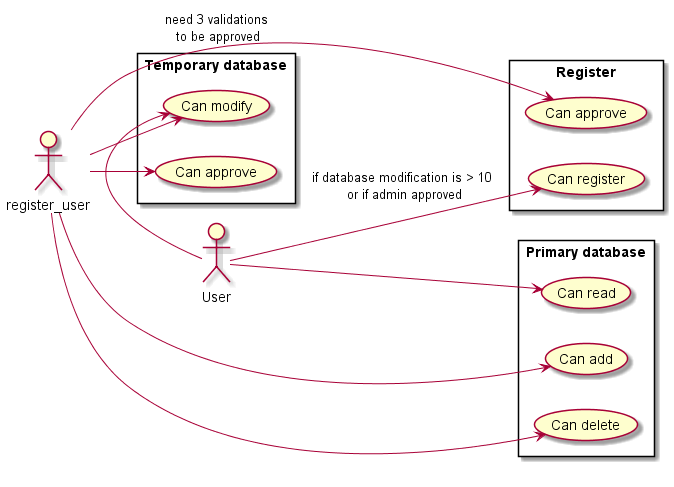
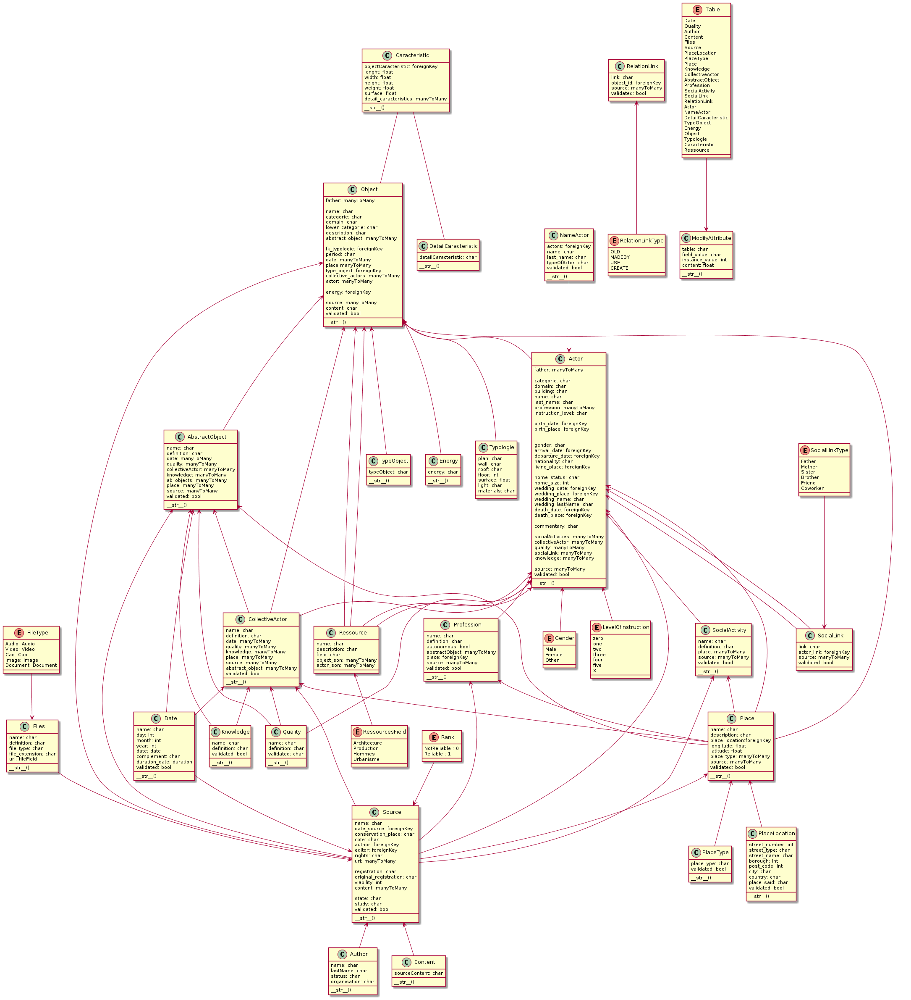

# API of the Techn’hom Time Machine

A historical and patrimony dababase used for Belfort's campus.
It is used for historical research

`French`
>[L'action « Techn’hom Time Machine » envisage le développement de nouvelles formes de recherche et d’apprentissage entre les sciences historiques (histoire, patrimoine, géomatique) et les sciences de l’ingénierie (génie mécanique, ergonomie, informatique, graphisme). Il s'agit d'expérimenter de nouvelles façons de produire la connaissance autour d’un objet historique grâce au croisement des compétences et au recours aux humanités numériques. L'objet vise la reconstitution numérique en 3D d’un vaste ensemble industriel implanté à Belfort en 1879, aujourd’hui connu sous le nom de Techn’hom. Il s'agit de proposer une histoire totale du quartier, retraçant les évolutions urbanistique, architecturale, technique, démographique ou encore sociale à partir de l’exploitation des archives, d’enquêtes de terrain, de témoignages oraux et du recours aux technologies informatiques. A court terme, le produit sera présenté sur une dalle numérique valorisant le mariage heureux entre histoire et ingénierie, technologie et patrimoine, et favorisant le lien social.]

## Requirement
*Git CLI
*UNIX Terminal
*Python 3.8.6 (or later)
*Pip 20.2.4

## Install project
1. `https://github.com/Gabryss/API.git`
2. `cd ./API`
3. `pip install -r requirements.txt`
4. `Install postgresql`
5. `Configure right database in API/settings.py (change password, name, user, host and port as your`
6. `python ./manage.py or manage.py(UNIX) runserver`

## Uninstall packages
* `pip uninstall -r requirements.txt`

# UML
## Overview of the project

### Usecase diagram

### Sequence diagram

## Model overview
### Class diagram

## Author
*[Gabriel Garcia]()